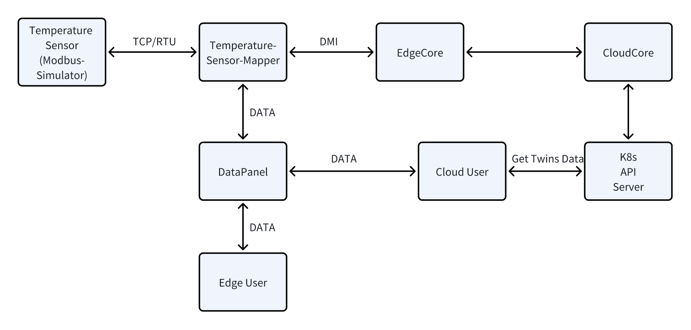
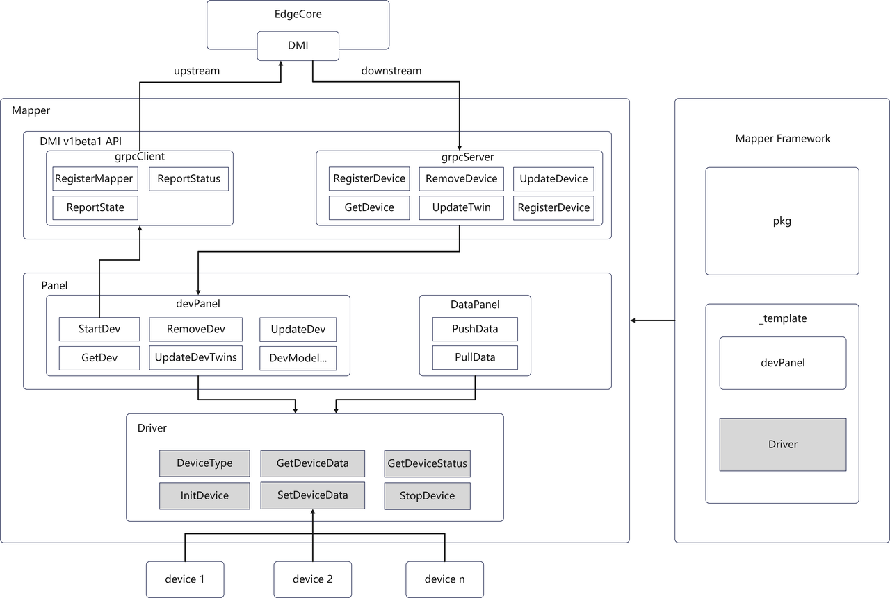
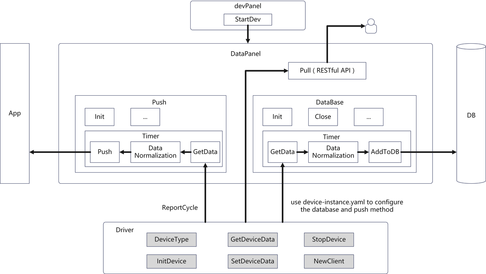

# KubeEdge device management practice cases optimization
## Motivation
The KubeEdge Examples repository provides users with many use cases, allowing them to quickly get started. However, many of the examples in the repository are currently developed based on the old version of KubeEdge (before v1.15), and there are compatibility issues with the new version of KubeEdge. Therefore, we need to optimize the examples in the repository so that they can run under the new version.

## Goals

### Develop a temperature sensor Mapper plug-in based on the latest version of Mapper-Framework
Based on the latest version of Mapper-Framework, develop a Modbus protocol Mapper device management plug-in, and use Modbus simulation software to simulate a temperature sensor. The Mapper plug-in needs to implement the management of the sensor, including device data collection, status reporting and other functions, and write and control the device through the RESTful API provided by Mapper. Finally, the implemented code needs to be merged into the KubeEdge Example repository, and a complete instruction document is attached to ensure that users can easily understand and apply the case.

### Optimize existing IoT cases
For the original Device-IoT cases in the KubeEdge Example repository, select at least one of them for iterative optimization, including ***kubeedge-counter-demo***, web-demo, etc. The optimization focuses on improving **compatibility**, **performance**, and **ease of use** to ensure that users can seamlessly use these cases in the latest version of KubeEdge. The optimized cases need to be merged into the KubeEdge Example repository and come with complete usage documentation.


## Proposal

### 1. Temperature-sensor-mapper development and testing

#### 1.1 Architecture 



  - As shown in the figure, Mapper-Framework implements the DevPanel and DataPanel components, completing functions such as data reporting, data pushing, data pulling, data storage, and Facility Management.
  - What developers need to implement is the IoT device driver capability and data write control capability. 
  - Therefore, the main tasks to be completed next are the development of the Driver and CRD components. This involves implementing the standardization of Modbus protocol data for the Device, completing functions such as device connection, data reading and writing, and specifically requires refining the DeviceType based on Device-Instance.yaml and implementing interfaces such as InitDevice, GetDeviceData, StopDevice, and SetDeviceData.
  - Finally, it is necessary to verify the functionality of the Mapper plugin. This can be done through RESTful API, cloud-based Twins viewing, MQTT, and checking Mapper logs, among other methods.
>Related APIs:
Control Switch:api/v1/devicemethod/default/temperature-instance/SwitchControl/temperature-switch/{data}
Modify Temperature:api/v1/devicemethod/default/temperature-instance/UpdateTemperature/temperature/{data}
Get Temperature: api/v1/device/default/temperature-instance/temperature
Get Status: api/v1/device/default/temperature-instance/status 
#### 1.2 CRDS Development
***Temperature-model.yaml***: 
Reference [v1beta1/device_model_types](https://github.com/kubeedge/kubeedge/blob/master/staging/src/github.com/kubeedge/api/apis/devices/v1beta1/device_model_types.go)
  - Add the two fields temperature and temperature-switch as attributes of the Temperature Sensor Model 
```yaml
apiVersion: devices.kubeedge.io/v1beta1
kind: DeviceModel
metadata:
  name: temperature-model
  namespace: default
spec:
  protocol: modbus
  properties:
    - name: temperature 
      description: actual temperature 
      type: FLOAT   # ENUM: INT,FLOAT,DOUBLE,STRING,BOOLEAN,BYTES
      accessMode: ReadWrite
      minimum: "0"  
      maximum: "100.0"  
      unit: "Celsius" 
    - name: temperature-switch
      description: "the switch of device 0:off,1:on"
      type: INT  
      accessMode: ReadWrite
```
***Temperature-instance.yaml***: 
Reference [v1beta1/device_instance_types](https://github.com/kubeedge/kubeedge/blob/master/staging/src/github.com/kubeedge/api/apis/devices/v1beta1/device_instance_types.go)

  - Custom protocol Modbus: Supports TCP and RTU modes
  - Add custom fields such as dataType, register, scale, offset, scale, isSwap, isRegisterSwap, max, min, etc. to properties.visitors.configData to facilitate driver operations 
  - Add methods for RESTful API calls
  - Optional: Enable pushmethod to push data to the specified end
  - By customizing the scaling factor, Min/Max, and communicateMode in configData, temperature supports floating-point input/output, threshold warnings, as well as rtu and tcp protocols 
```yaml
apiVersion: devices.kubeedge.io/v1beta1
kind: Device
metadata:
  name: temperature-instance
spec:
  deviceModelRef:
    name: temperature-model
  protocol:
    protocolName: modbus
    # Custom protocol configuration
    configData:
      communicateMode: "TCP"   # TCP/RTU
      port: "5502"             # replace the port with your modbus device port
      slaveID: 1
      ip: "127.0.0.1"   # 1.replace the ip with your modbus device ip
  nodeName: "kind-worker" # 2.replace the nodeName with your edge node name
  properties:
    - name: temperature
      visitors:
        protocolName: modbus
        configData:
          dataType: "float"  # Define the output format, consistent with the model type definition Enum::int/float/double/string/boolean/bytes
          register: "HoldingRegister" # Register Type Enum::CoilRegister/DiscreteInputRegister/HoldingRegister/InputRegister
          offset: 0  # Register offset
          limit: 1   # Number of registers to read
          scale: 0.1 # Scaling factor for temperature values
          isSwap: false  # Whether to swap bytes
          isRegisterSwap: false # Whether to swap registers
          max: 100.0  # Maximum value for temperature
          min: 1.0    # Minimum value for temperature
      collectCycle: 10000
      reportCycle: 10000
      reportToCloud: true
      # Enabling the push function requires deploying related services,like mosquitto broker
      # pushMethod:
      #   mqtt:
      #     topic: "current temperature"
      #     qos: 0
      #     address: "tcp://172.18.0.3:31883"  # replace the address with your mqtt broker address
      #     retained: false
    - name: temperature-switch
      collectCycle: 10000
      reportCycle: 10000
      reportToCloud: true
      desired:
        value: "1"
      visitors:
        protocolName: modbus
        configData:
          dataType: "int"
          register: "CoilRegister"
          offset: 0
          limit: 1
          scale: 1
          isSwap: false
          isRegisterSwap: false
  methods:
    - name: SwitchControl
      description: control the switch of the device
      propertyNames:
        - temperature-switch
    - name: UpdateTemperature
      description: update the temperature of the device
      propertyNames:
        - temperature
```

#### 1.3 Driver Development
  - DeviceType
    - DeviceType defines the existing fields and extended fields in model and instance. Therefore, corresponding type structure attributes need to be added based on the additional fields of model and instance.
  - Driver
    - InitDevice: Initialize ModbusClient using the incoming connection configuration, such as TCP/RTU
    - GetDeviceData: Retrieve register data from the modbus-simulator, check if the data is abnormal, and return the data after reasonable conversion. Tips: The return value is interface{}, which will be converted to a string when pushed to the twin, and can be combined with warnings to return a string.
    - DeviceDataWrite: Implement the corresponding data writing logic according to the predefined methods in temperature-instance, such as `UpdateTemperature`, etc.
    - SetDeviceData: Normalized data writing, normalizes the incoming data to uint16 and writes it to the corresponding register in the modbus-simulator.
    - StopDevice: Turn off the device and release resources (modbus-client)
    - GetDeviceStates: Get device status, whether the modbus-client has successfully connected to the modbus-simulator
#### 1.4 Analog Implementation of Temperature Sensor Device 
##### 1.4.1 via Modbus-Slave 
  - Advantages: Supports multiple protocol connections, including TCP, RTU, UDP, etc., with graphical operation,
  - Disadvantages: Currently only supports Windows, and the device-ip (i.e., the host IP) needs to be specified in the configuration file.
##### 1.4.2 via gomodbus
  - Framework:[http://github.com/thinkgos/gomodbus](http://github.com/thinkgos/gomodbus)
  - Advantages: There is no need to specify the device-ip in the configuration file, which facilitates quick testing.
  - Disadvantage: It can only be based on TCP connections and cannot simulate RTU.
  - Implementation Steps:
      1. Create TCP Server
      2. Add a register node list, where SlaveID = 1, the starting relative address of Coil is 0, the quantity is 1, representing the working status (0: Off, 1: On). The starting relative address of HoldingRegister is 0, the quantity is 1, representing the current temperature.
      3. Start the TCP server to listen on port 5502 
```go
package main

import (
        "github.com/thinkgos/gomodbus"
)

func main() {

        srv := modbus.NewTCPServer()
        // srv.LogMode(true)
        srv.AddNodes(
                modbus.NewNodeRegister(1, 0, 1, 0, 0, 0,1,0,0),
        )
        defer srv.Close()
        if err := srv.ListenAndServe(":5502"); err != nil {
                panic(err)
        }

}

```
#### 1.5 Deploy to KubeEdge environment for testing
  - Prior to this, the development of modbus-simulator and mapper had been completed, and cloudcore and edgecore had been configured. 
  - First, deploy modbus-simulator and mapper on the edge node. 
  - Next, deploy the model and instance in the CRDs.
  - Then, access the mapper's RESTful API via port **7777**(The API port is specified by the user, the default is 7777) to verify the device data collected in the mapper. Additionally, you can check the twins.reported field in the device.yaml file on the cloud to verify whether the data has been uploaded to the cloud. 
  - Finally, a web app can be built and deployed to the cloud for visual inspection of the results
### 2. KubeEdge-counter-demo Case Optimization
#### 2.1 Insufficient analysis
  - Usability: In the new version, manual installation of MQTT Broker is required, and the deployment steps are rather cumbersome.
  - Compatibility: 
    - Deprecated from Kubernetes 1.16 and completely removed in 1.21, cluster version ≥ 1.16, must use rbac.authorization.k8s.io/v1
    - GLIBC Version Compatibility: The Ubuntu version used for building the image is 18.04, with a lower GLIBC version, which cannot meet the requirements for running /pi-counter-app and /kubeedge-counter-controller, and needs to be upgraded to 22.04
    - Cloud node label compatibility: In kubeedge-web-controller-app.yaml, nodeSelector: node-role.kubernetes.io/master: "" is defined, which was the label for master nodes in k8s v1.19 and earlier, but was changed to node-role.kubernetes.io/control-plane after v1.20.
    - Since version v1.15, KubeEdge has updated to use v1beta1, deprecated the alpha series of APIs, and no longer supports backward compatibility.
    - The latest version of KubeEdge does not have a built-in MQTT broker and instead uses a custom protocol 
#### 2.2 Details of the optimization plan

##### 2.2.1  Compatibility Optimization 
  - Refactor the configuration files for the CRDs of model and instance 
    - Make it comply with the v1beta1 specification 
    - Add a read-only count attribute, and monitor the current number of the timer every 1 second
    - Add deviceMethod to modify status
  - Refactor counter-mapper using mapper-framework 
    - The counter timing section remains unchanged 
    - Create a CountClient interface for the pseudo device counter, which is responsible for controlling the counter instance, including collecting the data and status of the counter and modifying the status of the counter. 
    - Manage counters through the counter-client in the driver to implement functions related to Data Acquisition and modification 
  - Refactoring web-controller-app 
    - Interaction with the backend API is through REST API:
      - Get count: api/v1/device/default/counter-instance/count
      - Get status: api/v1/device/default/counter-instance/status
      - Update status: api/v1/devicemethod/default/counter-instance/status/{data}
    - Optimize Display Effect
      - Directly display the current count and status
      - Provide switch control status
##### 2.2.2 Usability Optimization
  - Simplify Deployment Steps 
  - Simplify the operation of web pages 
  - Provide more detailed documentation

## Plan
### In version 1.21
- Add a modbus mapper to the example repository
- Optimizing the counter-mapper example
